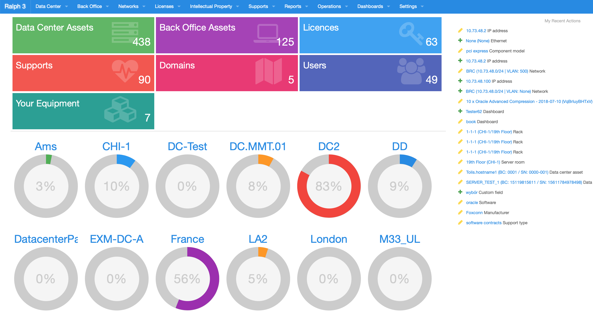
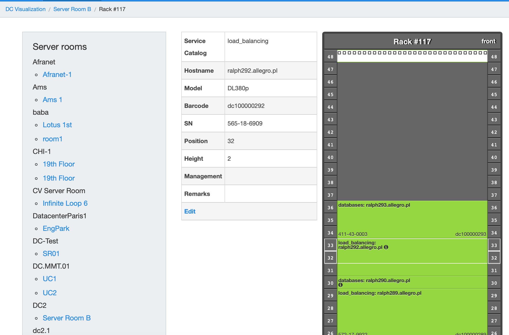
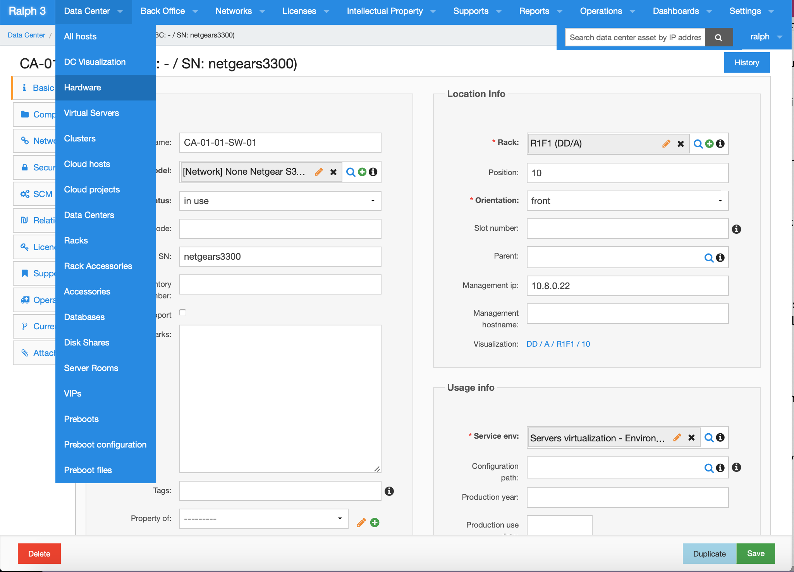
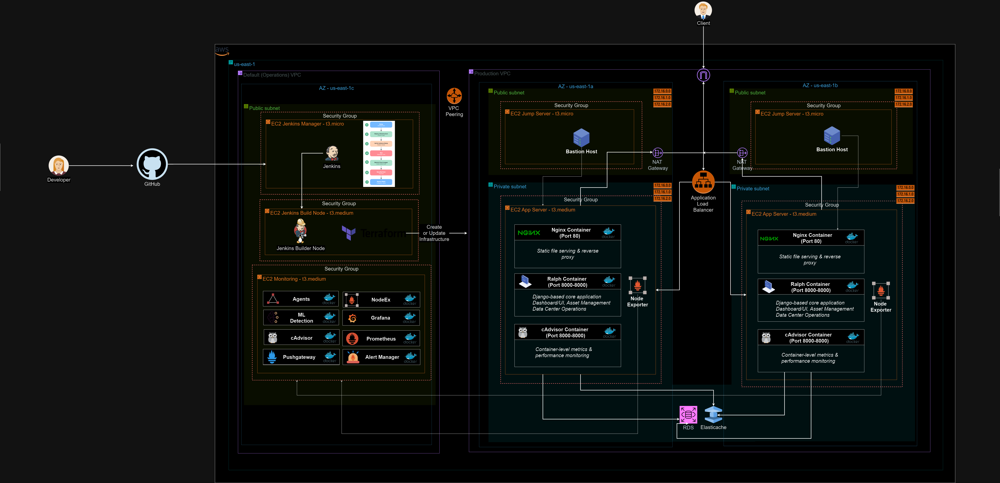
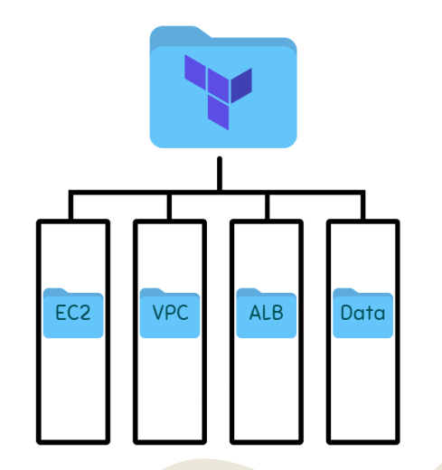
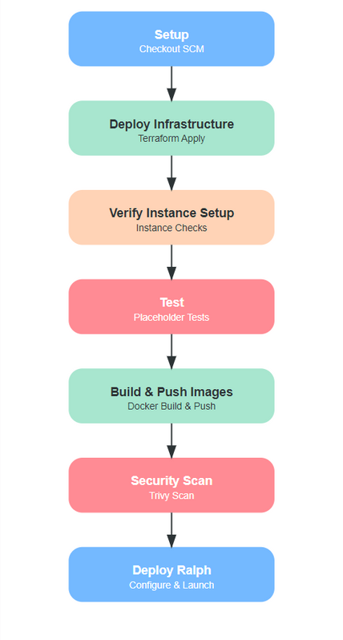
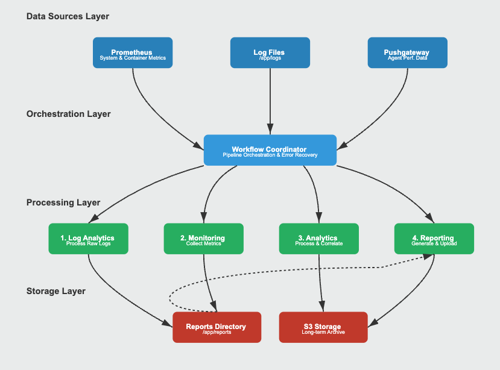
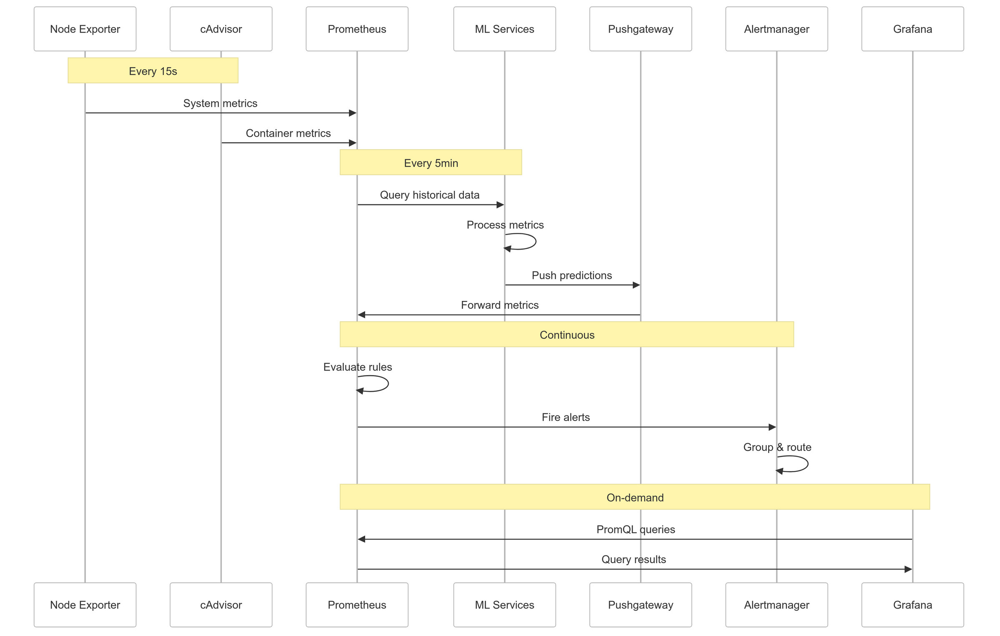

# Ralph Deployment: Automations, Release, and Security 🏗️

## Table of Contents 📖

1. [Overview](#overview)
2. [What is Ralph?](#what-is-ralph)
3. [Infrastructure Layout](#infrastructure-layout)
   - [Networking (VPC Module)](#networking-vpc-module)
   - [Compute (EC2 Module)](#compute-ec2-module)
   - [Database (RDS Module)](#database-rds-module)
   - [Load Balancing (ALB Module)](#load-balancing-alb-module)
4. [Docker Setup](#docker-setup)
5. [CI/CD & Automation](#cicd--automation)
   - [Some Jenkinsfile Highlights](#some-jenkinsfile-highlights)
   - [Optimizations & Road map](#optimizations--road-map)
6. [Performance Optimization](#performance-optimization)
   - [Caching Strategy](#caching-strategy)
   - [Query Optimization](#query-optimization)
   - [Environmental Impact](#environmental-impact)
7. [Lessons Learned & Common Issues](#lessons-learned--common-issues)
8. [Monitoring & Observability](#monitoring--observability)
   - [Layered Monitoring Architecture](#layered-monitoring-architecture)
   - [Continuous & On-Demand Insights](#continuous--on-demand-insights)
9. [Conclusion](#conclusion)
   - [Key Achievements](#key-achievements-of-this-implementation-include)
10. [Team Contributors](#team-contributors)

---

## Overview

This repository showcases a fully operational DevOps environment for **Ralph**, an open-source asset management, DCIM, and CMDB tool. While tailored for technical audiences—engineers, recruiters with a technical lens, and even decision-makers—it's accessible enough to impress a wide range of readers. Here, you'll find details on our infrastructure-as-code setup, CI/CD pipeline, and automation practices that minimize downtime and promote team agility.

## What is Ralph?

Ralph, in a nutshell, is an application that provides a one-stop solution to track IT assets and environments:

- IT Asset Management: Manage racks, servers, laptops, networking devices, and more.
- Configuration & Lifecycle Tracking: Track domains, IP addresses, DHCP/DNS configs, and maintain compliance.
- Licensing & Documentation: Integrate software licensing data, documentation, and compliance workflows.
- Security & Automation: Automated asset transitions, continuous security scanning, and lifecycle hooks that tighten operational integrity.

  
  
  

## Infrastructure Layout

We leverage **Terraform** for infrastructure provisioning and state management. By using **S3** to store Terraform state and **DynamoDB** for state locking, we ensure no accidental overwrites and consistent environment builds.

### Networking (VPC Module)

- Custom VPC with `10.0.0.0/16` CIDR.
- Multiple Availability Zones for high availability.
- Public/Private subnets, NAT/Internet gateways.
- VPC Peering for extended network reach and integration with other environments.

### Compute (EC2 Module)

- Private EC2 instances running Ralph, fronted by Nginx and orchestrated via Docker Compose.
- Public-facing bastion hosts enabling secure remote access.
- Strict security groups and `t3.medium` instances balancing cost and performance.

### Database (RDS Module)

- MySQL 5.7 RDS instance for Ralph's backend data.
- Redis (ElastiCache) for caching.
- Private subnet placement for security.
- Automated backups, maintenance tasks, and a `db.t3.micro` instance size for budget adherence.

### Load Balancing (ALB Module)

- Application Load Balancer routes traffic to Ralph's Nginx frontends.
- Health checks against `/login/` (Ralph) and `/metrics/` (cAdvisor and Node Exporter).
- HTTP listeners on 80, 8080, and 9100.

 

## Docker Setup

All application services run in Docker containers:

- **Web (Ralph):** Django-based Ralph application (port 8000).
- **Nginx:** Reverse proxy on port 80, serving static files and directing traffic to Ralph.
- **RDS & Redis:** Externalized data services.
- **cAdvisor & Node Exporter:** Container-level and node-level monitoring tools feeding into Prometheus/Grafana (maintained by my teammate Carl).

## CI/CD & Automation

I've built a baseline Jenkins pipeline designed for smooth, repeatable deployments:

- **Jenkins Manager:** Orchestrates build/test/deploy using code from GitHub.
- **Jenkins Builder Node:** Runs Terraform and Docker commands, ensuring consistent, locked state with S3 & DynamoDB.
- **Security Scans:** Integrated at the image build stage using Trivy.
- **No-Interruption Updates:** The pipeline updates infrastructure and code without compromising uptime. Using Terraform's remote state and locking, my team and I can safely push changes without stepping on each other's toes.

### Some Jenkinsfile Highlights

- **Infrastructure provisioning** via Terraform with `terraform init/plan/apply` steps.
- **Automatic verification** of EC2 provisioning (e.g., checking if Docker and Node Exporter are active).
- **Docker image build** and push to Docker Hub.
- **Security scans** with Trivy.
- **Automated Ralph deployment** and migrations, ensuring the latest code is always running.

From my perspective, I'm proud of the baseline pipeline because it's an MVP that can easily evolve. I used S3-backed state and DynamoDB locks so that incremental changes to the environment don't cause conflicts or accidental resource recreation.

### Optimizations & Road map:

1. **Selective Deployments:** Implementing logic to only run Terraform apply or Docker builds if certain files changed, speeding up overall runs.
2. **Caching Docker Layers:** Configuring a build cache to reduce image rebuild time for unchanged components.
3. **Parallel Testing & Scanning:** Splitting out security scans and tests into parallel stages for faster feedback.
4. **Dynamic Environment Naming:** Tag-based filtering in Terraform to ensure that test or dev environments are clearly separated, preventing naming conflicts.
5. **Immutable Artifacts:** Storing versioned Docker images and Terraform plans, ensuring rollbacks are simpler and more reliable.

## Performance Optimization

### Caching Strategy

- Redis cache hit ratio monitoring
- Cache warming procedures for cold starts
- Cache invalidation patterns
- Connection pooling configuration

### Query Optimization

- Regular database index maintenance
- Slow query analysis and optimization
- Query caching implementation
- Database parameter group tuning

### Environmental Impact

- Green Computing Initiatives
- Carbon footprint monitoring using AWS Customer Carbon Footprint Tool
- Optimization for energy-efficient instance types
- Automated resource scheduling for non-production environments
- Regular sustainability impact assessments

## Lessons Learned & Common Issues

- **Terraform state locking:** Without an S3 backend and DynamoDB lock table, subsequent builds risked causing resource re-creation. Now, only one Terraform job runs at a time, preserving infrastructure integrity.
- **Slower security scans:** Trivy scans initially slowed our pipeline. We introduced caching directories and refined severity levels to focus on critical issues first, reducing build times.
- **Idempotent deployments:** Ensuring that running the pipeline twice wouldn't break anything was tricky. Using built-in checks and “already running” logic in our Docker Compose deployments helped us achieve safer redeploys.
- **Stateful services:** Managing database and caching layers in private subnets ensured data integrity but required careful planning. Our approach? Automated backups and Terraform variables that handle credentials securely.

## Monitoring & Observability

Early in the project, we recognized the importance of a strong, layered monitoring approach. Thanks to our collective work, our monitoring stack provides real-time insights and historical context, ensuring that everyone on the team—developers, ops, and business stakeholders—can trust the environment's stability and performance.

### Layered Monitoring Architecture

Our observability strategy follows a layered model, ensuring each component has a clear role:

#### Data Sources Layer

- **Node Exporter:** Collects system-level metrics (CPU, memory, disk) every few seconds.
- **cAdvisor:** Gathers container-level metrics for deeper visibility into Ralph’s containers.
- **Prometheus:** Central metric store and time-series database, scraping metrics regularly.
- **Pushgateway:** Bridges ephemeral or batch jobs with Prometheus.
- **Log Files:** Raw application logs for analytics and alerting.

#### Orchestration Layer (Workflow Coordinator)

Acts as the conductor, routing metrics/logs from data sources to processing layers. Also handles error recovery, ensuring a misbehaving component doesn't stall the entire pipeline.

#### Processing Layer

- **Log Analytics:** Ingest raw logs, filter noise, and categorize them.
- **Monitoring:** Converts raw metrics into actionable insights, pre-processing data for quicker dashboard consumption.
- **Analytics (ML Services):** Detects patterns, anomalies, or predictive indicators.
- **Reporting:** Summarizes metrics, anomalies, and trends into digestible reports stored locally and in S3.

#### Storage Layer

Reports and historical data are saved both locally and in **Amazon S3**, giving us durable storage for audits, capacity planning, and long-term trend analysis.

### Continuous & On-Demand Insights

The diagrams we created show the cadence of metric collection and alert evaluations. For instance:

- **Continuous Collection & Evaluation:** Node Exporter and cAdvisor feed Prometheus every 15 seconds, and Prometheus applies alerting rules continuously.
- **Periodic Analysis & Predictions:** Every 5 minutes, Prometheus queries historical data, and our ML services run predictive analytics.
- **On-Demand Queries & Visualization:** Grafana allows on-demand PromQL queries for debugging, historical comparisons, and capacity planning.

## Conclusion

In this deployment of Ralph, we've demonstrated how great infrastructure, thoughtful automation, and a layered observability strategy can create a stable, scalable, and secure environment. By combining Terraform-driven infrastructure as code, a CI/CD pipeline that integrates seamlessly with security and performance optimizations, and a monitoring stack that provides both real-time insights and predictive analytics, we’ve built a platform that can grow and adapt with our evolving needs. Our approach ensures that every update, from code changes to scaling decisions, can be made confidently and safely—paving the way for continuous improvement and long-term success.

## Key achievements of this implementation include:

- A fully automated deployment pipeline that ensures consistency, security, and reliability
- Multi-layered monitoring providing actionable insights across the stack
- Infrastructure designed for high availability and security
- Performance optimizations that balance cost with efficiency

Looking ahead, this architecture provides a solid foundation for scaling and enhancement. The MVP architecture sets the stage for performance optimizations, enhanced caching strategies, and expanded monitoring capabilities. The modular design we’ve implemented means we’re well-positioned to iterate and improve as our needs evolve.

## Team Contributors 🌟

- **Shafee Ahmed** - Release Manager: Led CI/CD pipeline development, Terraform state management, and ensured zero-downtime deployments.
- **Triston Ortiz** - AI Chatbot Developer: Integrated chatbot functionalities into Ralph to streamline user interactions.
- **Ke Zhou** - Team Director/IaC: Provided Terraform scripting, AWS provisioning, and environment structuring.
- **Carl Gordon** - System Administrator: Handled monitoring, logging, alerting with Prometheus, Grafana, and related tools.
